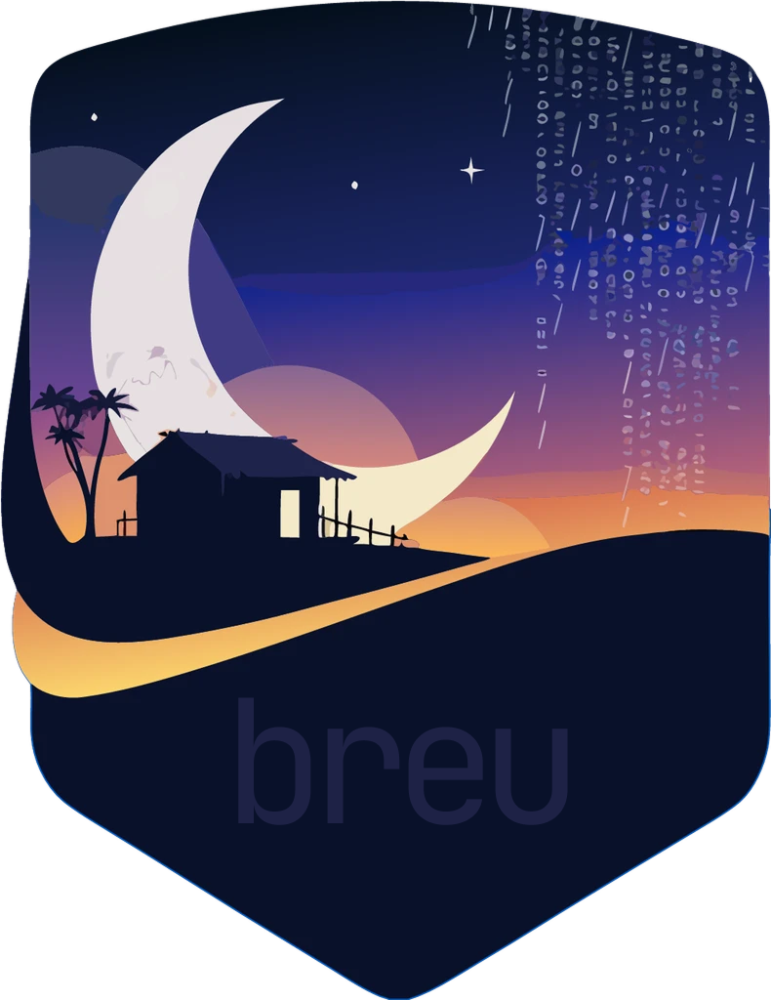
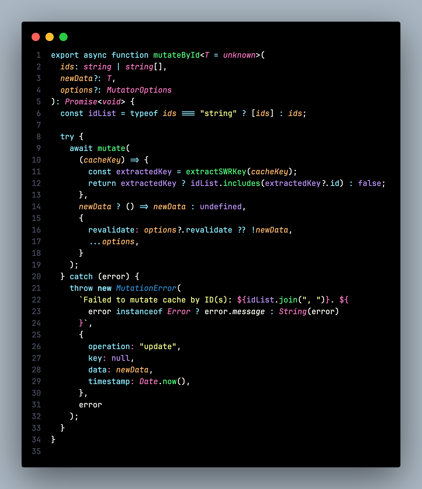
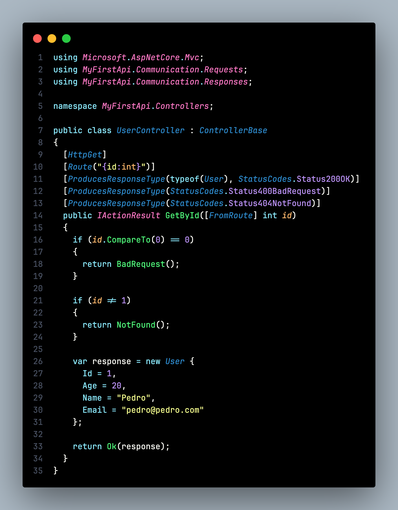

<p align="center">
  
</p>

# Breu

A dark theme for Visual Studio Code with a true `#000000` black background.


## Screenshots

### TypeScript



### C#



## Installation

### VS Code Marketplace

1. Open **Extensions** sidebar (`Cmd+Shift+X`)
2. Search for `Breu`
3. Click **Install**
4. Go to **Preferences > Color Theme** and select **Breu**

### Open VSX (VSCodium)

1. Open **Extensions** sidebar
2. Search for `Breu`
3. Click **Install**
4. Select **Breu** from Color Theme

### Manual Installation

```bash
git clone https://github.com/pedroab0/breu.git ~/.vscode/extensions/breu
```

Restart your editor and select the theme.

## Color Palette

| Color | Hex | Usage |
|-------|-----|-------|
|  | `#000000` | Editor background |
|  | `#F8F8F2` | Default text |
|  | `#8BE9FD` | Keywords, storage, JSON keys |
|  | `#50FA7B` | Functions, attributes |
|  | `#FFB86C` | Parameters, warnings |
|  | `#FF79C6` | Tags, types, separators |
|  | `#BD93F9` | Constants, `this`/`self` |
|  | `#FF5555` | Errors, deletions |
|  | `#F1FA8C` | Strings, quotes |
|  | `#2E8CCF` | Classes, info |
|  | `#6272A4` | Comments, muted text |

## Features

- True black (`#000000`) background for OLED displays
- Full terminal ANSI color support
- Semantic highlighting enabled
- Comprehensive syntax highlighting for 15+ languages
- Debug panel theming
- Git decoration colors

## Documentation

See [THEME.md](THEME.md) for complete color documentation.

## License

[MIT](LICENSE) © Pedro Barbosa
